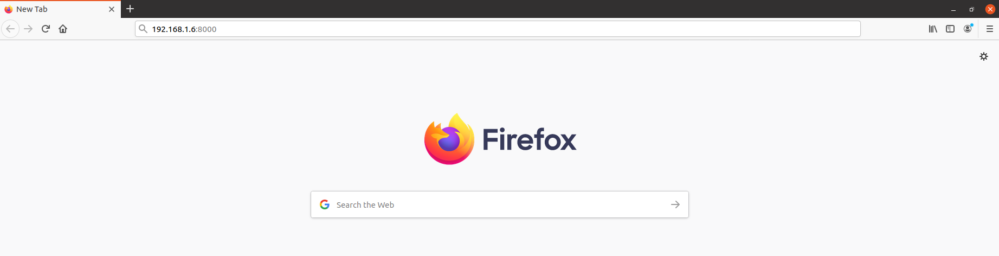

The **Dragino LPS8** is a LoRaWAN indoor gateway based on the OpenWrt Linux system. The hardware includes an SX1308 LoRa concentrator that provides 10 programmable parallel demodulation paths. The gateway has an ethernet and WiFi backhaul and supports EU868, IN865, US915, AU915, AS923, and KR920 ISM bands.

<!--more-->

This page guides you on how to connect the Dragino LPS8 to {}.



## Prerequisites

1. A user account on {} with user rights to add gateways.
2. An LPS8 connected to the internet.
3. A computer on the same network as the LPS8.
4. The latest version of firmware running on the Dragino LPS8 (read the Dragino LPS8 [user manual](https://www.dragino.com/downloads/downloads/LoRa_Gateway/LPS8/LPS8_LoRaWAN_Gateway_User_Manual_v1.2.0.pdf) for instructions on firmware upgrade).

## Register the Gateway on {}

Create a gateway by following [the instructions](). The Gateway EUI can be derived from the WiFi MAC address that can be found on the back of the gateway enclosure. To get the 8 byte Gateway EUI insert `4150` at the end of the WiFi MAC address.
 
 If the WiFi MAC address is `A8:A8:41:A8:CE:54` then the Gateway EUI is `A8 A8 41 A8 CE 54 41 50` 

## Configuring the LPS8

Enter the IP address and port number of your gateway in the browser (the default port number is 8000, E.g. `192.168.1.6.:8000`)

In the prompt box, type your username and password and then click **OK**.

 The default username is `root` and the password is `dragino`. 

Once you logged in, you will navigate to the home page of the configuration portal that is a web-based GUI.

On the portal page, on the top menu, select **LoRaWAN > LoRaWAN**.

Edit the server settings.

1. **LoRaWAN Service Provider**: Choose **Custom** from the drop-down list.
2. **Server Address**: Provide your LoRaWAN Gateway Server address. You can find it on {} **Gateway Overview** page.
3. **Gateway ID**: This is the Gateway EUI. Make sure that the Gateway EUI already appeared in the text box is match with the one you have derived from the WiFi MAC address in the previous section.
4. **Server Port Upstream**: Upstream port of the Gateway Server, typically 1700.
5. **Server Port Downstream**: Downstream port of the Gateway Server, typically 1700.

Select **Save & Apply**.

Finally, test your connection by going to the gateway’s **Overview** page. You can see the gateway status is changed as connected (with a blue dot) or the frequently updating ‘Last seen’ time.

