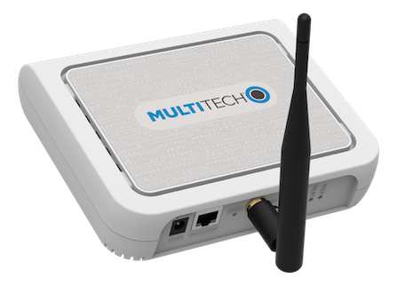

The [MultiTech MultiConnect® Conduit™](http://www.multitech.net/developer/products/multiconnect-Conduit-platform/) is a configurable, scalable cellular communications gateway for industrial IoT applications. The technical specifications of the Conduit can be found in the software guide in the [official documentation](http://www.multitech.net/developer/products/multiconnect-conduit-platform/conduit/) page.

This guide will help you set up the Multitech Conduit gateway to communicate over {}.

<!--more-->

## Prerequisites

1. User account on {} with rights to create Gateways.
2. Multitech Conduit AEP Gateway running [mPower 5.30 firmware or later](http://www.multitech.net/developer/downloads/).

## Registration

Create a gateway by following the instructions for [Adding Gateways]().

> The gateway EUI can be found at the bottom of the gateway under the field &quot;LORA NODE&quot;.

## Setting Up the Gateway

For the first-time hardware and software setup, you can refer to the appropriate configuration guide on the [Multitech documentation](http://www.multitech.net/developer/products/multiconnect-conduit-platform/conduit/) page.

We have included a few short steps to help you get started.

### Connecting to the Gateway as a DHCP Server

Since the gateway initializes as a DHCP server, you may have to configure TCP/IP manually. After hard resetting the device, we connected it directly to a computer via ethernet and used the following TCP/IP settings:

- IP Address: 192.168.2.2
- Subnet Mask: 255.255.255.0
- Router Address: 192.168.2.1

Browse to the IP address of the gateway, 192.168.2.1.

You may be met with the following screen. In newer versions of Chrome, you can type "thisisunsafe" to continue past the certificate error screen. Other browsers have different ways of advancing past certificate error screens.



Once past the certificate screen, create a username and password.

You will then be met with the first time setup screen. Click **Next**.



Set a time and date, and skip the rest of the configuration options.



Once you have finished the first time setup, click the **Setup** button in the left hand menu, and choose **Network Interfaces**.

Click on the pen icon for the **eth0** interface to modify it.



Set the **Direction** dropdown to **WAN**, and the **Mode** dropdown to **DHCP Client**.

Click **Submit** to save the settings.



Next, click the **Administration** button in the left hand menu, and choose the **Access Configuration** submenu.

Here, enable the **Web Server for HTTP** via **LAN** and **WAN**, and enable **HTTPS** access via **WAN**.

Optionally, you can also enable **SSH** via **WAN**.

> Don't miss this part! If you don't enable Web Server or SSH access via WAN, when you connect the gateway to your local network, you will not be able to access it anymore, and you will have to hard reset and start over.



Click **Submit** to save the Access Configuration Settings.



After you have submitted both the **Ethernet Configuration** and **Access Configuration** settings, double check them so you don't lock yourself out!

Finally, click **Save and Apply** to apply your configuration.

At this point, the gateway will reboot. It will come back online as a DHCP client, so you can disconnect it from your computer, and connect the gateway directly to your router or local network.

## Connecting the Gateway to {}

The Multitech Conduit supports {} and the legacy UDP packet forwarder. {} is more secure and supports configuration of custom channel plans, amongst other improvements. {} supports {}, so please follow instructions for [connecting the Multitech Conduit with {}]().

If for some reason {} is not available to you, instructions for connecting with the legacy packet forwarder are [here]().

## Troubleshooting

### Packet Forwarder Logs

Packet forwarder logs contain the messages received from the devices and the network server. You can use the information to debug the issues.

You can find the packet forwarder logs using the gateway&apos;s web console. Do the following to download the logs onto your device:

- Login to your gateway&apos;s web console and navigate to **Administration -> Debug Options**.
- Click on the **Download Logs** button in the **Logging** section to download the logs.



Now, in the downloaded logs, open the *lora-pkt-fwd-1.log* file to see the packet forwarder logs.

### Upgrading the Firmware

If you have an issue with the current firmware version, you can use following steps to upgrade the firmware.

Refer to the top of your configuration software window to check your firmware version. You have to upgrade the device&apos;s firmware to the latest version.

You can download the firmware upgrades from the downloads section of the [MultiTech website](http://www.multitech.net/developer/downloads/).

Do the following to upgrade the firmware on your device:

- Before you upgrade your firmware, save your present configuration as a backup.
- Go to the MultiTech website, locate the firmware upgrade file you want for your device(MTCDT AEP x.x.x in the current case, where x.x.x is the latest version available on the website), and download this file to a known location.
- Navigate to **Administration -> Firmware Upgrade**.
- Click on **Choose Firmware Upgrade File** button, and
  - Click on **Browse** to find where the firmware file resides that you want to apply.
  - Select the file and click on **Open**. The file name appears next to the **Choose Firmware Upgrade File** button. Make sure you select the correct BIN file; otherwise, your device can become inoperable.
- Click on **Start Upgrade**.



- A message about the time needed to upgrade appears. Click on **OK**.
- A progress bar appears indicating the status of the upgrade. When the upgrade is completed, your device reboots.
- After the firmware upgrade is completed, verify your configuration to ensure that it is same as what you expected.

> Note: The new firmware is written into flash memory. It may take up to 10 minutes to upgrade the firmware. Do not interrupt the devices&apos; power or press the reset button during this time.
