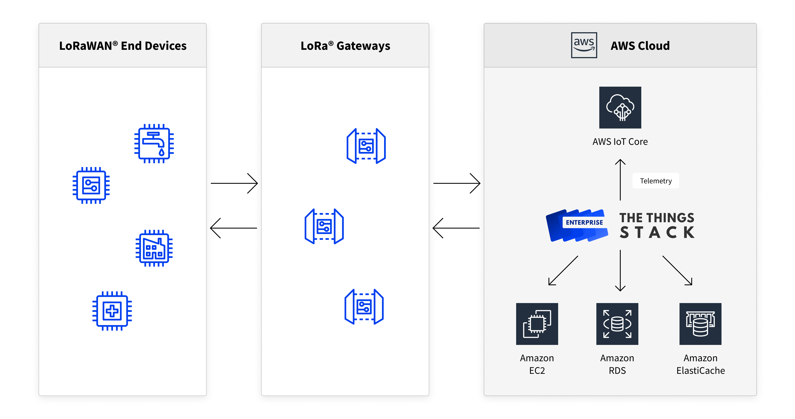
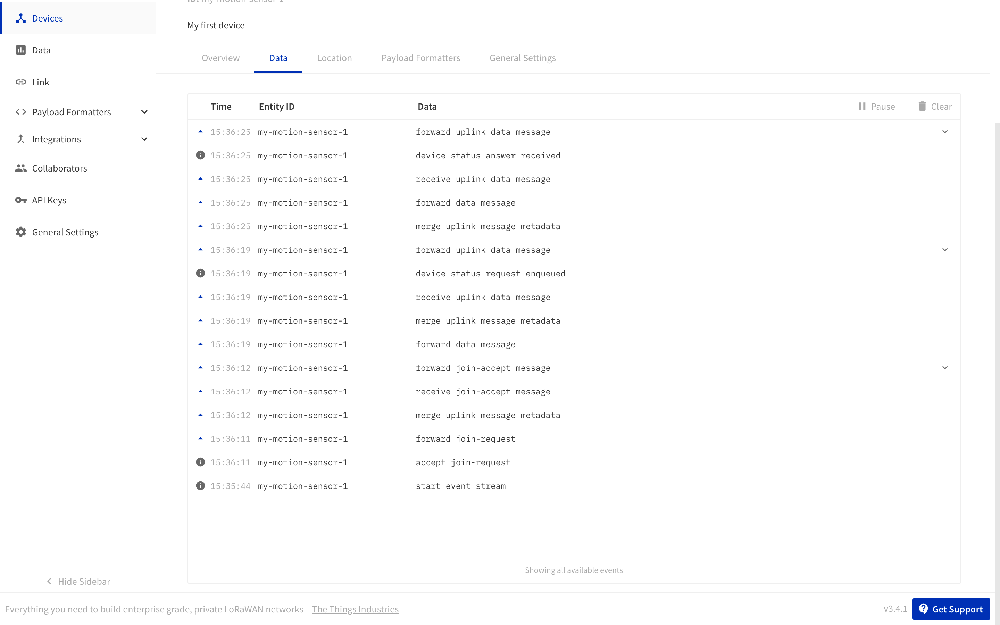

## Overview

This section contains a detailed information to help you setup {} via the [AWS Marketplace listing](https://aws.amazon.com/marketplace/pp/B081HZKDJ4?qid=1593444260869&sr=0-1&ref_=srh_res_product_title).



### AWS Deployment Architecture

The following image describes the architecture of the components that are deployed while using the **default parameters**.


## Preparation

This section lists the preparatory steps necessary to successfully complete this guide.

### Specialized Knowledge

In order to follow this guide to deploy {}, it is recommended to be familiar with the following concepts
- AWS EC2, AWS CloudFormation
- Shell and command line usage
- Basics of LoRaWAN devices and gateways

### Prerequisites

The following are necessary to complete this guide
1. An account with AWS with access to the AWS Marketplace. If you don't have one, one can be created using the [Create an AWS account](https://portal.aws.amazon.com/billing/signup#/start) page.
2. An RSA Public-Private Key pair
3. Your AWS account requires sufficient rights to create IAM roles.
4. A LoRaWAN compliant Gateway. This guide uses a [Tektelic Kona Micro]( https://tektelic.com/wp-content/uploads/KONA-Micro.pdf).
5. A LoRaWAN compliant End Device. This guide uses [Smart Building Sensors - Motion sensor](https://connectedthings.store/gb/home-and-office-sensors/smart-building-sensors-motion-sensor-eu868.html).
6. Access to a name server to map DNS.

## Deployment using AWS Cloud Formation

### Step 1: Prepare your deployment

1. Login to your AWS Marketplace and navigate to the [product page for {} for LoRaWAN](https://aws.amazon.com/marketplace/pp/B081HZKDJ4).
2. Choose the correct AWS Region in which to deploy your stack. Also choose the Software Pricing Tier that suits your needs.
3. Make sure to read the terms of usage and other information available.
4. If applicable, [request a service limit increase](https://console.aws.amazon.com/support/cases#/create?issueType=service-limit-increase&limitType=service-code-) for additional VPCs and/or Elastic IPs.
5. Click **Continue to Subscribe** and accept the terms and conditions once they are found satisfactory.
6. Now click **Continue to Configuration** to configure your deployment.

### Step 2: Configure your deployment

The **Continue to Configuration** button will redirect you to the AWS CloudFormation page where the CloudFormation template is pre-loaded. 
This template allows the user to customize the deployment. The following is a list of the supported parameters that are available to the user.

#### Basic Configuration

|**Parameter**|**Description**|**Default**|
|---|---|---|
|EC2 Instance Name|Name of your {} EC2 instance.|`the-things-enterprise-stack`|
|Domain|Domain name. You should be able to configure DNS for the domain. TLS certificates from Let's Encrypt will automatically be requested.|-|
|Network Title*|The title of your deployment.|`{} for LoRaWAN`|

> \* This is an optional field

#### Security Configuration

|**Parameter**|**Description**|**Default**|
|---|---|---|
|Admin Username|Name of the admin user|`admin`|
|Admin Email|Email address of the admin user|`admin@mycompany.com`|
|Initial Admin Password|Initial admin password. Please choose a strong password. It is recommended to change this password upon first login.|-|
|Amazon RDS Database Username|Username of the relational database|`postgres`|
|Amazon RDS Database Password|Password for the relational database. This password is used to access the Amazon RDS database.|-|
|SSH Key|Name of an existing EC2 KeyPair to enable SSH access to your instance.|-|
|SendGrid API Key*|API key for [SendGrid](https://sendgrid.com/) to send emails.|-|
|License Key for {}|The license key for {}.|-|

> \* This is an optional field

#### External Connectivity

|**Parameter**|**Description**|
|---|---|
|Restrict SSH Access to IP Range|The source IP address range that can be used to connect via SSH to the EC2 instances. Use 0.0.0.0/0 for global SSH access.|
|Restrict Service Access to IP Range|The source IP address range that can be used to connect to the deployed services. Use 0.0.0.0/0 for global access.|

#### User Registration

All of the fields below are optional.

|**Parameter**|**Description**|**Default**|
|---|---|---|
|Require Admin Approval|If set to true, administrator approval is needed for creating new accounts.|false|
|Require Email Validation|If set to true, validation of contact information is necessary to create new accounts.|false|
|Require User Invites| If set to true, email invites are necessary to create new accounts.|false|
|Minimum Length|Minimum length for user passwords.|8|
|Minimum Number of Digits|Minimum number of digits for user passwords.|1|
|Minimum Number of Special Characters|Minimum number of special characters for user passwords.|0|
|Minimum Number of Uppercase Letters|Minimum number of uppercase letters for user passwords.|1|

#### Resource Settings

The fields in this section are for advanced users. A change to some of these parameters might incur additional costs.

|**Parameter**|**Description**|**Default**|
|---|---|---|
|EC2 Instance Type|EC2 Instance Type|t3.small|
|Redis Backup Retention Period*|The retention period for daily Redis backups (days).|7|
|Redis Instance Type|The size of machine for the Redis instance.|cache.t2.small|
|Enable Multi-AZ for Redis| If true, replicas of Redis are created. If true, RedisNumCacheClusters property must be greater than 1.|false|
|Number of Redis Multi-AZ Instances|The number of replicas for this replication group. If RedisMultiAZSupport is true, this value must be greater than 1. Note that this multiplies the Amazon ElastiCache Redis instance costs.|1|
|Amazon RDS Database Name|Name of the relational database. (Warning) A change to this field requires manual migration of the database.|ttn_lorawan|
|Amazon RDS Instance Type|The instance type for the Amazon RDS database.|db.t3.small|
|Amazon RDS Backup Retention Period|The retention period for daily Amazon RDS backups (days). (Warning) A change to this field requires manual migration of the database.|7|
|Amazon RDS Postgres Version|PostgreSQL version for the Amazon RDS database.|11.4|
|Enable Multi-AZ for Amazon RDS| If true, a failover instance is created in case the primary instance fails. Note that this doubles the Amazon RDS instance costs.|false|

#### LoRaWAN Network Server Settings

The following parameters are optional

|**Parameter**|**Description**|**Default**|
|---|---|---|
|LoRaWAN JoinEUI Prefix|Prefix for the LoRaWAN JoinEUIs that are handled by this network.|0000000000000000/0|
|LoRaWAN DevAddr Prefix|Prefix for the LoRaWAN DevAddrs that are handled by this network.|00000000/7|
|LoRaWAN NetID|The LoRaWAN NetID that is assigned through [LoRa Alliance membership](https://lora-alliance.org/become-a-member). This is required if your network needs interoperability (e.g. roaming, peering, join flow) with other networks. If you do not have a NetID, please use 000000 or 000001.|000000|

#### AWS IoT settings

|**Parameter**|**Description**|**Default**|
|---|---|---|
|AWS IoT Telemetry|If set to true, publish all upstream messages to AWS IoT.|true|

#### Update From Existing Deployment

The following parameters are exclusively meant for updating an existing deployment.

|**Parameter**|**Description**|
|---|---|
|Amazon RDS Snapshot|The ARN (Amazon Resource Name) of the Amazon RDS snapshot to restore the database from.|
|Amazon ElastiCache Redis Snapshot|The name of the Redis snapshot to restore the database from.|
|S3 Profile Pictures Bucket Name|The name of the S3 bucket for profile pictures.|
|S3 End Device Pictures Bucket Name|The name of the S3 bucket for end device pictures.|

### Step 3: Start your deployment

1. Once the parameters of the stack are configured, click **Next** to configure options for the CloudFormation Stack. You may use the defaults in this page. 
2. Click **Next** review the deployment. Select the **I acknowledge that AWS CloudFormation might create IAM resources.** checkbox and click **Create Stack** option. 
3. If all the parameters were entered correctly, AWS CloudFormation triggers the creation of your CloudFormation stack. The stack is now in the `CREATE_IN_PROGRESS` state. On average, this process takes about 40 minutes.
4. You can monitor the status of your deployment by navigating to **CloudFormation** > **\<your-stack\>** > **Events**.
5. Once the required resources are successfully deployed, the state of the CloudFormation stack is updated to `CREATE_COMPLETE`.

### Step 4: DNS Configuration

In order to access the Console/API of the {}, the domain name chosen during deployment must be mapped to the public IP address of the CloudFormation stack. This section provides details on how to do that.

1. In AWS Console and open the CloudFormation resource and click on your recently deployed stack.
2. Navigate to the **Outputs** tab and copy the value of the **PublicIP** field.

Now, login to the Domain Name Management window of the Domain Name Registrar to which your preferred Domain is registered. Create a DNS **A** record with the parameters shown below.

|**Name**|**Record Type**|**Value**|
|---|---|---|
|`@`|`A`|**PublicIP**|

If you are using a sub-domain,

|**Name**|**Record Type**|**Value**|
|---|---|---|
|`sub-domain`|`A`|**PublicIP**|

For example, if your **PublicIP** value is `3.12.14.15` and your sub-domain is `lorawan.mycompany.com`, then navigate to the management tab for the domain `mycompany.com` and perform the following mapping

|**Name**|**Record Type**|**Value**|
|---|---|---|
|`lorawan`|`A`|3.12.14.15|

There will be an initial propagation delay for this value to be updated. You can check the status via a DNS lookup using either an [online tool](https://network-tools.webwiz.net/nslookup.htm) or using a command line tool (ex: `nslookup`).

Once the domain has been propagated, the DNS Lookup will show that your Domain (or sub-domain) is pointing to the **PublicIP** value.

#### SSL Certificates

As a security measure, plaintext access to the Console/API is disabled. In order to serve requests securely, {} has built-in support to automatically request, serve and renew SSL certificates. Apart from the DNS mapping above, no additional steps are necessary for this.

### Step 5: Login to {}

Once you've ensured that the DNS Mapping works, you can now login to the console of {} using the url `https://domain/console`.
If you're using a subdomain then use `https://subdomain.domain/console`


> There might be a delay of a few seconds while the stack sets up the SSL Certificates. This happens only the very first login.

Click on **Login** and enter the **Admin Username** and **Initial Admin Password** that you set during the deployment.


> We highly recommend you to update your password upon the first login.

## Routing LoRaWAN Traffic

Now that your stack has been successfully deployed, let's look at how to connect a LoRaWAN Gateway, Register a LoRaWAN Device and read traffic from this device.

### Connecting a Gateway

In this section, we will be using a [Tektelic Kona Micro IoT LoRaWAN Gateway](https://tektelic.com/wp-content/uploads/KONA-Micro.pdf). For other gateways, please refer to our [Docs](https://enterprise.thethingsstack.io).


1. Check the back panel of the Gateway and locate the field named **GW ID**. This is a 16 character alpha-numeric value.
2. Login to {} Console as explained above.
3. Select the **Register a gateway** icon.
4. Fill in the details as described below. All the other fields can remain defaults.

|**Field**|**Value**|**Example**|
|---|---|---|
|Gateway ID|Choose a unique, valid Identifier|`tektelic-1`|
|Gateway EUI| The **GW ID** field located on the back panel of the gateway|-|
|Gateway Name|Choose an easy to remember name | `my-test-tektelic`|
|Gateway Description|Describe your gateway|`My test Tektelic`|
|Frequency Plan|Choose this based on your operating Region|-|

5. Select **Create Gateway**
6. Connect the Gateway to an ethernet cable and plug in the power adapter.
7. Find the IP address the gateway. This can be done in various ways. You can connect your machine to the same local network as that of the gateway Ethernet connection and scan for open SSH ports or assign a static IP to the gateway and use that.
8. Once the gateway IP address is found, ssh into it. The password for the root user can be found on the back panel. It’s typically a 9 character alphanumeric string starting with 1846XXXXX.
```
$ ssh root@<GatewayIP>
```
9. Now you can edit the gateway configuration file.
```
$ vi /etc/default/config.json
```
> Press the i key on your keyboard to start insert mode. Once finished editing, press ESC and enter :wq to write the file and quit.

10. Edit the server parameters.

|**Parameter**|**Value**|
|---|---|
|**server_address**|**domain** or **sub-domain** configured earlier|
|**serv_port_up**|1700|
|**serv_port_down**|1700|

11. Restart the packet forwarder

```
$ /etc/init.d/pkt_fwd restart
```

### Registering a device

In this section, we'll be using a Tabs Motion Sensor [insert link]. It uses a Passive Infrared Detector and Fresnel Lens to detect motion in a room. This data is then sent to the network via LoRaWAN.

The following steps are necessary to configure the device to work with {}.

1. Login to {} Console and click on the **Go to applications** section. Click on **Add Application**.
2. Fill in the details 

|**Field**|**Value**|**Example**|
|---|---|---|
|**Owner**|Choose a user|`admin`|
|**Application ID**|Choose a unique, valid Identifier|`my-motion-sensors`|
|**Application Name**|Choose an easy to remember name|`my-motion-sensors`|
|**Description**|Describe your application|`My collection of room sensors`|
|**Link automatically**|**Checked**|-|
|**Network Server Address**|Leave blank|-|

Click **Create Application**.

3. In your application, click **Add Device** and fill in the details

|**Field**|**Value**|**Example**|
|---|---|---|
|**Device ID**|Choose a unique, valid Identifier|`my-motion-sensor-1`|
|**Device Name**|Choose an easy to remember name|`my-motion-sensor-1`|
|**Device Description**|Describe your device|`My first sensor`|
|**MAC Version**|**MAC V1.0.2**|-|
|**PHY Version**|**PHY V1.0.2 REV B**|-|
|**Frequency Plan**|Choose this based on your operating Region|-|
|**Supports Class C**|**Unchecked**|-|
|**Network Server Address**|Leave default value|-|
|**Application Server Address**|Leave default value|-|
|**Activation Mode**|**Over The Air Activation (OTAA)**|-|
|**JoinEUI**|A 16 digit value provided by the device maker. This would be called AppEUI.|-|
|**DevEUI**|A 16 digit value provided by the device maker. This would be called DEVEUI. You can also find this value on the back panel of the device below the QR code.|-|
|**External Join Server**|**Unchecked**|-|
|**Join Server Address**|Leave default value|-|
|**AppKey**|A 32 digit value provided by the device maker. This would be called APPKEY. ||
|**NwkKey**|Leave blank|
|**Reset Join Nonces**|**Unchecked**|-|

Click **Create Device**.

4. To activate the device for the first time, pull the small transparent film on the device labelled **REMOVE BEFORE USE**. This triggers the activation sequence in the device.

5. While the device is trying to join the network, the Blue LED emits a short blink every 10 seconds. Once the device successfully joins, it sends the initial uplink values and the corresponding events can be seen on the data tabs of the console.



### AWS IoT

AWS [IoT](https://aws.amazon.com/iot/) is a service for managing IoT devices. {} supports publishing of uplink messages directly to the AWS IoT suite. In order for this to work, the **AWS IoT Telemetry** option in the CloudFormation template must be set to **true** during the deployment phase.

AWS IoT suite can be used to subscribe to detailed uplink messages as well as get insights into aggregated metrics of your uplink data. 

1. Login to the AWS Console in the *same region* as where the CloudFormation template is deployed.
2. Search for **IoT Core** service and click to enter the IoT Core window.
3. On the left-hand panel, select the **Test** option. In the central panel, choose **Subscribe to a topic**.
4. In the **Subscription topic** field enter `lorawan/<cloud-formation-stack-name>/<application-id>/things/<device-id>/up` to subscribe to the uplinks for a particular device. 
For example, if your CloudFormation stack name is `my-lorawan-server`, the application ID is `my-motion-sensors` and the device ID is `my-motion-sensor-1`, then the topic would be `lorawan/my-lorawan-server/my-motion-sensors/things/my-motion-sensor-1/up`. 
When the device sends an uplink message, it will be displayed in this window in the preferred format.
The following is an example payload in JSON format:
```
{
  "format": "json",
  "payload": {
    "end_device_ids": {
      "device_id": "my-motion-sensor-1",
      "application_ids": {
        "application_id": "my-motion-sensors"
      },
      "dev_eui": "xxxxxxxxxxxxxxxx",
      "join_eui": "xxxxxxxxxxxxxxxx",
      "dev_addr": "009C0D6F"
    },
    "correlation_ids": [
      "as:up:01DYMZ1NKBT0B8NACFV6NJWG2J",
      "gs:conn:01DYMY19DNK1R2EG9P79YQYB97",
      "gs:uplink:01DYMZ1NCF2NAX6HJS3TX6SKAH",
      "ns:uplink:01DYMZ1NCGW37WNSSKKJR86515",
      "rpc:/ttn.lorawan.v3.GsNs/HandleUplink:01DYMZ1NCGB9FBVPQK74WA20YT"
    ],
    "received_at": "2020-01-15T16:02:10.668892406Z",
    "uplink_message": {
      "session_key_id": "AW+poh7YEnPnhTgVoA5a2A==",
      "f_port": 102,
      "f_cnt": 13,
      "frm_payload": "AdsmAADiAAA=",
      "decoded_payload": {
        "bat_percentage": 86.66666666666667,
        "count": 226,
        "events": "motion",
        "status": 1,
        "temp": 6,
        "time": 0,
        "voltage": 3.6
      },
      "rx_metadata": [
        {
          "gateway_ids": {
            "gateway_id": "tektelic-1",
            "eui": "xxxxxxxxxxxxxxxx"
          },
          "timestamp": 1453994219,
          "rssi": -3,
          "channel_rssi": -3,
          "snr": 9.5,
          "uplink_token": "CiMKIQoVdGVrdGVsaWMtZGVzay1nYXRld2F5Eghkf9r//gBccRDr4ai1BQ==",
          "channel_index": 1
        }
      ],
      "settings": {
        "data_rate": {
          "lora": {
            "bandwidth": 125000,
            "spreading_factor": 7
          }
        },
        "data_rate_index": 5,
        "coding_rate": "4/5",
        "frequency": "867300000",
        "timestamp": 1453994219
      },
      "received_at": "2020-01-15T16:02:10.448769590Z"
    }
  },
  "qos": 0,
  "timestamp": 1579104130996,
  "topic": "lorawan/my-lorawan-server/my-motion-sensors/things/my-motion-sensor-1/up"
}
```
5. On the left-hand panel, click on the **Monitor** option for aggregated metrics on uplink data. The **Sample period** and **Time range** can be adjusted using the drop down links on the top right-hand corner.
The following is a sample of the **Messages** and **Messages published** windows for an hour sampled every 5 minutes.


## Troubleshooting

This section contains information to troubleshoot {}.

### FAQ

1. My stack creation failed
2. How can I SSH into my machine?
   - You can SSH into the EC2 machine using the public IP output value. In AWS Console and open the CloudFormation resource and click on your recently deployed stack. Navigate to the **Outputs** tab and copy the value of the **PublicIP** field. Now using the private key of the **SSH Key** value that you entered during deployment, you can SSH into the machine using
   ```
    $ ssh -i <path-to-private-key> ec2-user@<PublicIP>
   ```
3. How can I see logs of {}?
   - {} binary runs as a `systemd` service. In order to access the logs, SSH into the machine as described above and use the following command.
   ```
    $ sudo journalctl -f -u lorawan-stack.service
   ```
4. How do I see more detailed debug logs of {}?
   - By default, {} does not log detailed `DEBUG` messages. In order to enable this, SSH into the EC2 instance as described above and add the following lines to the file `/tti/lorawan-stack/config.yml` using an editor such as `nano`.
   ```
   log:
     level: debug
   ```
   - Restart the service for this to take effect.
   ```
    $ sudo systemctl restart lorawan-stack.service
   ```
   - The debug logs can be read using the `journalctl`, same as above:
   ```
    $ sudo journalctl -f -u lorawan-stack.service
   ```
5. My Gateway doesn't connect. What do I do?
   - Ensure that the configuration of the gateway is correct. This includes, the server address, port and frequency plan settings. Check the logs as described in the steps above to locate the potential cause of the issue. You can also check the gateway logs for potential clues. For the Tektelic gateways, SSH into the gateway as described in the previous sections, and use the following command:
   ```
    $ tail -f /var/log/pkt_fwd.log
   ```
6. My device doesn't join. How do I fix this?
   - Device join failure could be due to a number of reasons. Ensure that the device settings are correct. This includes the JoinEUI, DevEUI and/or AppKey/NwkKey and the frequency plan settings. Check the logs as described above to locate the potential cause of the issue.

### Professional Support

Additional paid support for this deployment is offered by The Things Industries. You can contact us either by mailing us at `support@thethingsindustries.com` or by visiting [our support page](https://www.thethingsindustries.com/stack/aws/support). 

### Additional Documentation

More detailed documentation covering various aspects of {} can be found at `https://enterprise.thethingsstack.io`.
