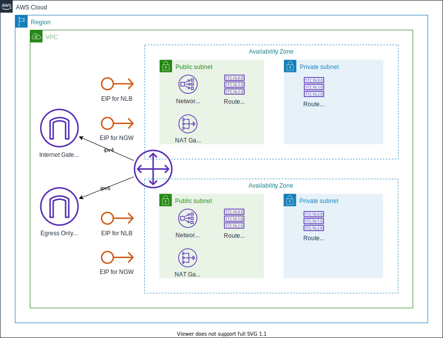
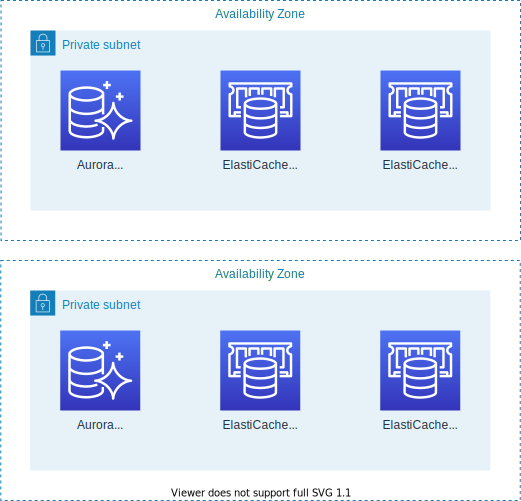
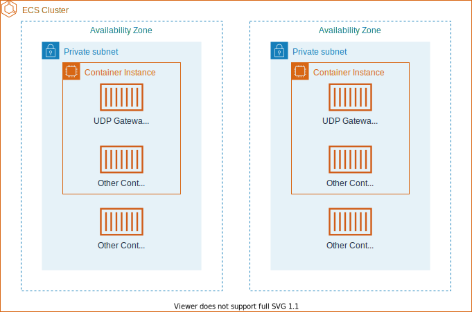
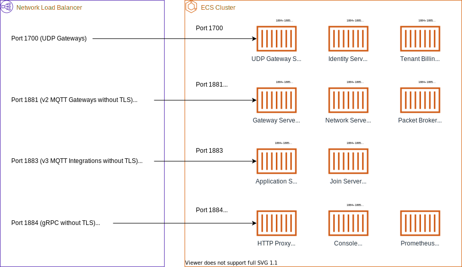

This page describes the architecture of a {} deployment on AWS ECS.

<!--more-->

## VPC and Subnets

The foundation of the deployment is the Virtual Private Cloud (VPC) that lets us create an isolated environment within the AWS cloud.

We will deploy {} across two availability zones (AZs). In each AZ we have a private subnet that will contain the resources for {} such as databases, container instances and the application containers themselves. Since these resources can't communicate with the internet directly, we also have public subnets that contain a Network Load Balancer (NLB) for load balancing incoming traffic across instances and a NAT Gateway (NGW) for outgoing connections from resources in the private subnet. The NLBs and NGWs all have Elastic IP address. All incoming connections to {} will use the IP addresses of the NLBs, and all outgoing connections will use the IP addresses of the NGWs. This means that you can use these IP addresses in the firewall rules for gateways that need to connect to your deployment, and on other servers that need to connect to your deployment or receive connections (webhooks) from it.

## Persistence

{} relies on two databases: PostgreSQL and Redis. AWS offers these databases as managed services, so that we can focus on operating a LoRaWAN network instead of operating databases. We use a PostgreSQL-compatible version of Amazon Aurora and a Redis-compatible version of Amazon ElastiCache. Both PostgreSQL and Redis are deployed in a multi-AZ master-replica setup. If desired, it is possible to use separate Redis clusters for persistent storage and for caching.

User uploads of profile pictures and end device pictures are stored in S3 buckets.

> **NOTE:** In multi-cluster deployments, the PostgreSQL database, the S3 bucket for profile pictures and the S3 bucket for end device pictures are only deployed in the primary cluster.

## Configuration

The AWS ECS deployment of {} uses a combination of configuration stored in AWS Systems Manager Parameter Store, secrets stored in AWS Secrets Manager and other environment variables that are set directly on the ECS tasks.

The configuration for interoperability with other LoRaWAN Backend Interfaces-compliant servers can become quite complicated and is therefore stored as multiple files in an S3 bucket.

## Containers

{} itself is deployed as Docker Containers on AWS ECS.

The ECS cluster uses container instances in the private subnets of both availability zones. Each container instance runs at least a Gateway Server container that is dedicated for UDP gateways. This is necessary because of the limited support for UDP in ECS. Depending on your preferences, you can run other containers on your container instances, or choose to use AWS Fargate.

## Networking

All internal communication between the different components of {} is done over gRPC (port 1884) and HTTP (port 1885). For incoming connections from outside the cluster, ECS registers a number of services in the Network Load Balancer.

In addition to containers for the different components of {}, our deployment also contains proxy containers to route HTTP and gRPC requests to the correct component. Prometheus containers are used for monitoring the deployment.

> **NOTE:** In multi-cluster deployments, the Identity Server containers in secondary clusters are replaced with containers that proxy requests to Identity Server in the primary cluster.
