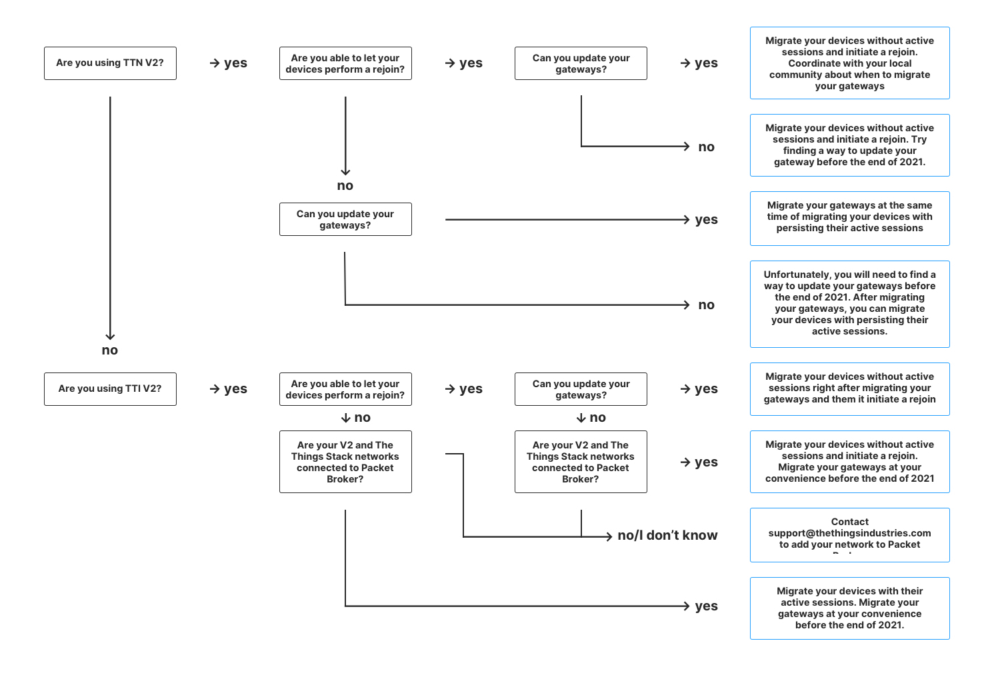

This section documents the process of migrating end devices from {} to {}.

<!--more-->

 We highly recommend to always test the migration on a single end device or a small batch of end devices in order to make sure the migration process goes as expected. 

## Prerequisites

1. User account on The Things Network {} or The Things Industries {}.
2. End device(s) and gateway(s) connected to a {} network.
3. User account in {}.

 We **highly recommend** using {} version `3.12.0` or higher. Some of the features (like session migration) from this guide might not be available for prior versions. 

## Add Application in {}

Since end devices are being created within applications, you first need to add a new application in {}.

 When adding an application in {}, the **Application ID** does not have to be the same as the one in {}. 

> See [Adding Applications]() for detailed instructions.

## Add Payload Formatters and Integrations in {}

After creating an application, you need to add the associated elements like application-level payload formatters and integrations.

 The payload formatters can be uplink and downlink, and they are what was known in {} as coders and decoders. The format of payload coders and decoders is still supported in {}.

In {}, it is also possible to add payload formatters per end device, which override application payload formatters. However, before devices are migrated to {} it is only possible to add a payload formatter per application. 

> See [Payload Formatters]() guide for detailed instructions on how to add payload formatters and which types are supported by {}. 

> For detailed tutorials on the integrations that are available in {}, see [Integrations]().

## Migrate End Devices

When you have added your application and elements associated with it, it is time to migrate your end device(s) from {} to {}.

 End devices connected to The Things Network V2 can be migrated to {} Cloud and {} Community Edition without the need for migrating a gateway, thanks to the default connection with [Packet Broker](). The Things Industries V2 (SaaS) can also be connected to Packet Broker by contacting [support](mailto:support@thethingsindustries.com), while {} Enterprise or Open Source can be [configured]() manually.

If you are using deployments connected to Packet Broker, the traffic from your end device(s) will be routed to {} after migrating your device(s). However, there are certain requirements that your devices need to meet for Packet Broker to route their traffic to {} correctly. See [Packet Broker Requirements for End Device Migration]() for detailed information.

If you are using deployments that are not connected to Packet Broker, you will have to [migrate your gateway]() to receive traffic from your end device in {}. 

 We recommend The Things Network community members to keep their gateways registered on The Things Network V2 for as long as possible (i.e. to migrate their devices via Packet Broker), or to agree on performing coordinated migration to {} together with the local community to ensure reliable LoRaWAN network coverage. 

There are two approaches for migrating devices, depending on how many end devices you intend to migrate and if you wish to migrate with or without active sessions, described in the following guides:

- [Using {} Console]() - this method is convenient only for small number of devices. Migrating active device sessions is not supported.
- [Using `ttn-lw-migrate` tool]() - this method allows migrating devices in bulk, optionally with active device sessions.

## Migration decision tree
Migrating from V2 to The Things Stack Cloud or The Things Stack Community Edition (click on the image to enlarge).

