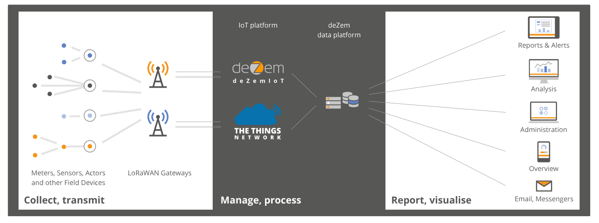
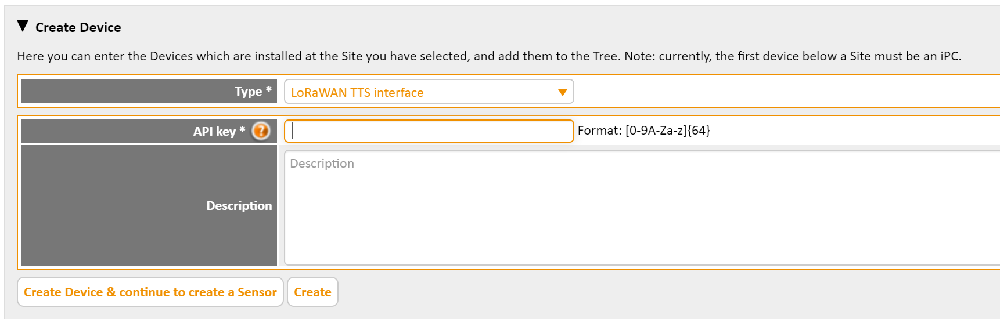
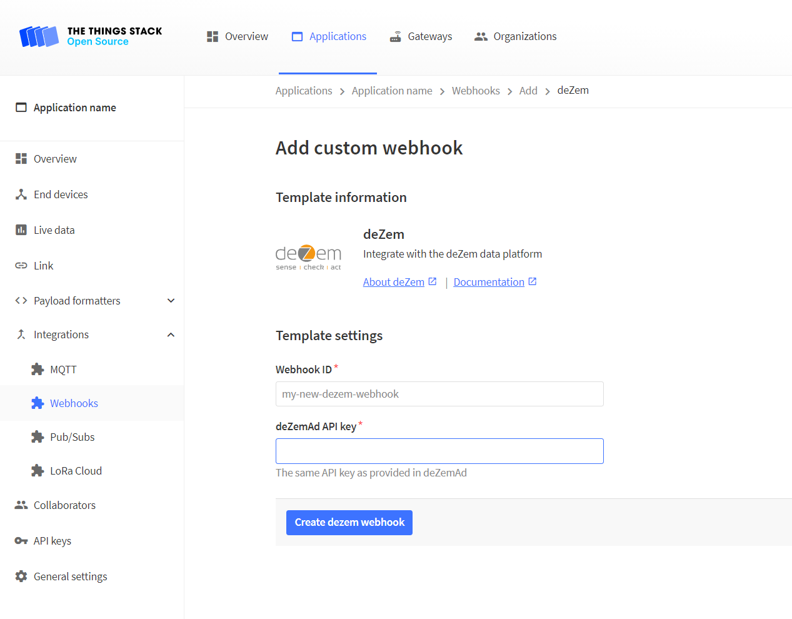
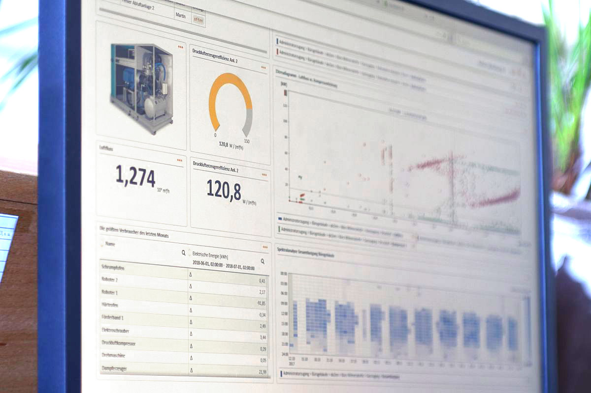

The [deZem IoT data management system](https://www.dezem.de/en/data-acquisition/lorawan/) facilitates an increased efficiency and productivity of plants, processes and infrastructure. To this end, deZem provides a modular solution to collect sensor data from very heterogeneous sources on a single platform, and a large variety of online analysis tools. As LoRaWAN devices are great for effortless data acquisition in the field, the deZem system integrates with {}.

## Prerequisites

1. deZem account
2. User rights for deZemAd's technical tree

## Setup

In the technical tree of deZemAd, create a new device of type 'LoRaWAN TTS interface'.

Configure the same API key in deZemAd and in deZem's Webhook template.

## Analyze and Visualize

Create analyses and visalisations for use in production.

