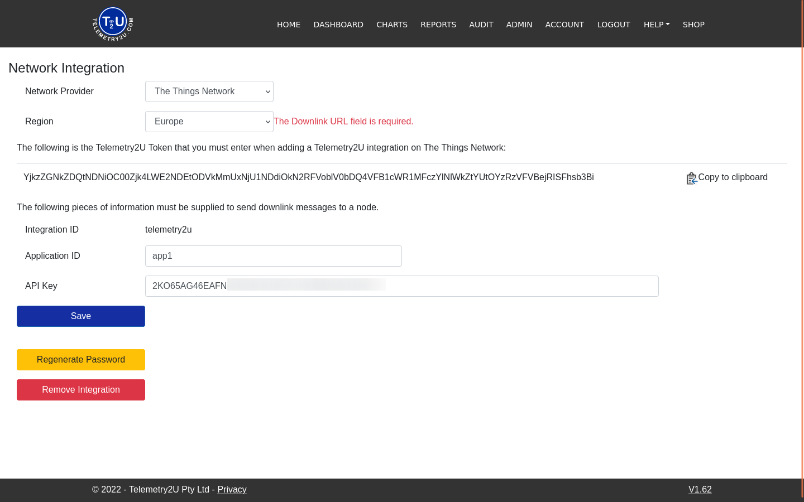
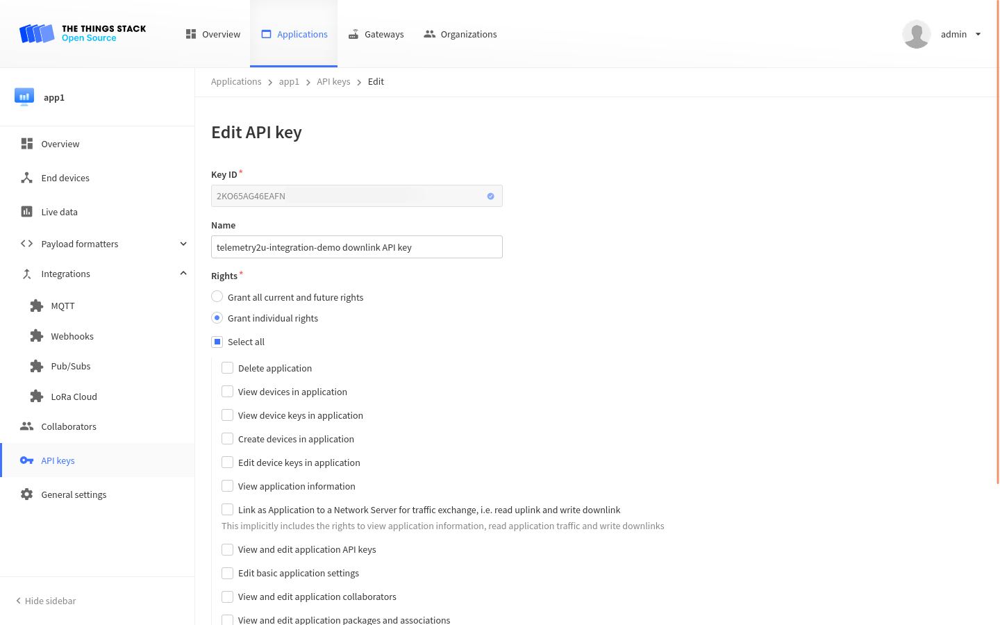

[Telemetry2U](https://telemetry2u.com/) is a complete IoT platform that requires little setup and configuration yet still provides advanced features, such as voice alerts, scheduled audit reports, configurable real-time dashboards and even calibrations.

## Prerequisites

1. A [user account](https://telemetry2u.com/Identity/Account/Register) on Telemetry2U.
2. [Activated 14-day free trial](https://telemetry2u.com/Identity/Account/Manage/Subscriptions) or a PAYG plan on Telemetry2U.

## Setup Telemetry2U
First [login](https://telemetry2u.com/Identity/Account/Login) to your Telemetry2U account and navigate to **Node Maintenance** via **Admin** tab from the top menu.

Click the __Create New__ link in the top right corner to add a new LoRaWAN device.

Complete the form as required.  The __Description__, __Profile__, __Device EUI__, __Network Provider__ and __Device Configuration__ are the minimum requirements. If your device is currently unsupported leave __Device Configuration__ at the default value.  Click the __Create__ button when complete.

## Setup The Things Stack Integration
From your Telemetry2U account, navigate to __Setup Integration__ via __Admin__ from the top menu. Select __The Things Network__ from the __Network Provider__ drop down box and hit the __Add Integration__ button.

Select the __Region__ your TTN account is registered under and make a copy of the __Telemetry2U Token__ with the __Copy to clipboard__ button.

Retrieve your __Application ID__ from The Things Stack and enter it into the __Application ID__ field.

The __API Key__ won't be known until the TTN integration has been created so click the __Save__ button and leave the browser tab open.

Log into The Things Stack and open your application.  Using the side menu, navigate to __Webhooks__ via __Integrations__ and click the __Add webhook__ button in the top right corner.

Choose **Telemetry2U** Webhook template.

Use **telemetry2u** as the **Webhook ID** and enter the **Telemetry2U Token** you copied to the clipboard earlier. This will be an alphanumeric string approximately 100 characters long.

Use {} left hand menu to navigate to **API Keys**, select the downlink API key and copy its **Key ID** into the **API Key** section in the integration configuration page on Telemetry2U. Click the **Save** button to complete the integration.

**Congratulations**! Your integration is now complete and once data has been received by {}, it should become available under the [Telemetry2U Reports Page](https://telemetry2u.com/Reports). 

 If you're using an unsupported device on Telemetry2U, you can select **Raw Data** as the report type to confirm data is being received. You may then forward a copy of the device documentation including the payload format and device EUI to Telemetry2U support via [email](mailto:support@telemetry2u.com) and they will get your device's support added ASAP. 
