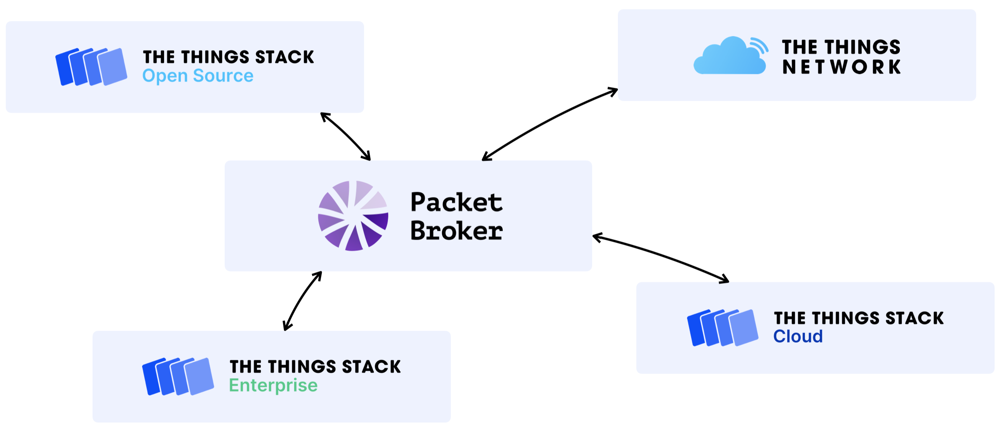

## What is it?

Packet Broker uses LoRaWAN® peering to exchange traffic with other LoRaWAN networks to share coverage and improve the overall network performance.

For a video explaining what LoRaWAN peering is, and how Packet Broker works, see [LoRaWAN Networks, Roaming and Peering in 5 minutes](https://youtu.be/TQImwfHCraM).

Show video



Packet Broker supports class A and C downlink as well as OTAA device activations.

## Who is it for?

Exchanging traffic can be beneficial for all public and private LoRaWAN network operators: it can improve overall network performance by increasing resilience against gateway failures, expanding coverage area and optimizing end device battery life by communicating with the nearest gateways.

### Typical Use Cases

1. Forward uplink traffic received by your gateways from devices to their home network. The home network may also use your gateways to transmit downlink traffic to their devices. You can also put commercial agreements in place to monetize coverage.
2. Receive uplink traffic for your devices from other networks, and use those other networks to transmit downlink traffic to your end devices.

## How Does it Work?

Packet Broker distinguishes two types of networks: Forwarders and Home Networks. Forwarders are networks with gateways: they forward uplink messages from the gateways to Packet Broker, and downlink messages from Packet Broker back to the gateways. Home Networks are networks with end devices.

Your {} deployment can be a Forwarder, a Home Network or both. This means that you can make your physical gateway infrastructure available to other networks without having end devices. Likewise, you can deploy end devices as a Home Network, without physical gateway infrastructure.

Packet Broker routes uplink messages from Forwarders to Home Networks based on the 32-bit `DevAddr` in the uplink message. The first part of the `DevAddr` is the `NetID`, a globally unique identifier of a LoRaWAN network. Packet Broker uses the `NetID` to lookup the Home Network. Besides identifying Home Networks by `NetID`, Packet Broker also supports tenants. Tenants use a `DevAddr` block of a Home Network host.

For example, a message with `DevAddr` `27ABCD12` has `NetID` `000013` (owned by The Things Network Foundation). The `DevAddr` block `27ABCD00` to `27ABCDFF` might be assigned to a private network `example-com`. That `DevAddr` block is noted as `27ABCD00/24`: 24 significant bits. Packet Broker identifies the Home Network then as `NetID` `000013` and tenant ID `example-com`.

The Things Network is identified by `NetID` is `000013` and tenant ID `ttn`.

### Routing Policies

Routing policies define the rules that Forwarders configure for routing messages to Home Networks. Routing policies are peer-to-peer: a Forwarder can define policies with each individual Home Network. Forwarders can also define an optional default routing policy that is used as a fallback when no specific policy is defined.

Forwarders can configure the following message types per direction in a routing policy:

| Type                | Uplink | Downlink | Description                                                              |
| ------------------- | :----: | :------: | ------------------------------------------------------------------------ |
| Join                |   O    |    O     | Join-request (uplink) and join-accept (downlink) messages                |
| MAC payload         |   O    |    O     | Data messages with `FPort` `0` (for network layer instructions)          |
| Application payload |   O    |    O     | Data messages with `FPort` `1` or higher (for application layer payload) |
| Signal quality      |   O    |          | RSSI and SNR information                                                 |
| Localization        |   O    |          | Gateway locations, timestamps and signal quality                         |

For instance, a Forwarder may wish to configure three policies:

1. With Home Network that has `NetID` `000013` and tenant ID `ttn` (The Things Network): all message types. This would mean to forward join-requests and join-accepts, uplink and downlink MAC and application payload messages, and signal quality and localization information.
2. With Home Network that has `NetID` `000013` and tenant ID `example-com`: only join-requests, join-accepts and uplink and downlink MAC and application payload messages. This would mean to not forward the metadata.
3. A default policy (for all other networks): only uplink MAC and application payload messages. That would mean to not forward join-requests and join-accepts, and to not forward the metadata.

### Gateway Visibility Settings

Gateway visibility configuration allows network administrators to configure who sees which gateway-related information. Having gateways listed publicly on the map can help discovering partner networks, but it may also lead to privacy concerns. Therefore, Packet Broker allows configuring gateway visibility with fine-grained settings.

Forwarders can configure the visibility of their gateways towards the public or specific Home Networks. Like routing policies, gateway visibility is configured peer-to-peer: a Forwarder can define gateway visibility with each individual Home Network. Forwarders can also define an optional default gateway visibility that is used as a fallback when no specific visibility is defined.

Forwarders can configure the following fields:

| Type                | Description                                                     |
| ------------------- | --------------------------------------------------------------- |
| Location            | Gateway coordinates                                             |
| Antenna placement   | Indoor/outdoor antenna placement                                |
| Antenna count       | Number of antennas                                              |
| Fine timestamps     | Whether the gateway produces fine timestamps                    |
| Contact information | Administrative and technical contact information of the gateway |
| Status              | Online/offline status                                           |
| Frequency plan      | Region and channel plan with frequencies that the gateway uses  |
| Packet rates        | Receive and transmission packet rates                           |

## Getting Started

{} and {} Cloud are already connected to Packet Broker. Proceed to [Configure]() section to manage your registration and routing policies with other networks.


{} and {} Cloud are configured for peering within the same geographical region. For example, {} `eu1` cluster is configured to peer only with {} Cloud `eu1` deployments and vice versa. Peering between `eu1`, `au1` and `nam1` clusters is not currently enabled.


When you are using {}, you cannot configure any routing policies, as {} is a public network and The Things Network Foundation controls which public or private networks the traffic gets exchanged with. To manage routing policies for your gateways, upgrade to {} Cloud.

When using {} Enterprise of {} Open Source, learn to [Connect {} to Packet Broker]().

## LoRaWAN Roaming vs Packet Broker

Packet Broker is a global backbone for LoRaWAN traffic. It is designed to securely exchange traffic between LoRaWAN networks.

Packet Broker supports LoRaWAN passive roaming, but it goes even beyond that:

- Packet Broker allows for individual packet selection: networks do not get charged for traffic they did not consume.
- Packet Broker separates traffic routing from billing and clearing: networks are free to put commercial agreements in place to settle balances.
- Packet Broker separates payload from metadata: networks only get charged for the value they need.
- {} has native support for Packet Broker and can access the global coverage provided by The Things Network.

## Status Page

Visit the [Packet Broker services status page](https://status.packetbroker.net/) to check the current status of Packet Broker services. Be up do date with the recent Packet Broker upgrades, scheduled maintenances and reported incidents.
